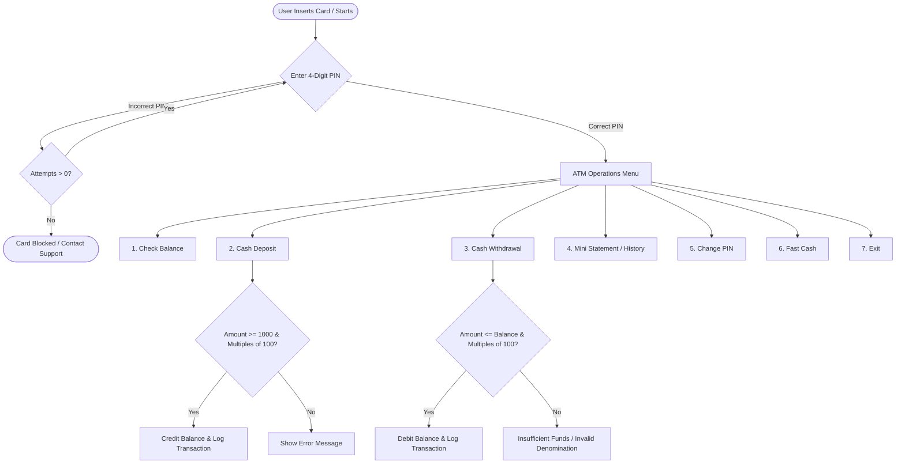

# 🏧 ATM Simulator System Architecture

The **ATM Simulation System** (`ATM__Project.py`) is an interactive terminal application designed using Object-Oriented Programming (OOP) principles.

---

## 🏛️ Class & Data Structure Design

The core `ATM` class manages user data in an internal dictionary (`user_info`) and tracks session state.

```python
class ATM:
    def __init__(self, name, mobile, pin, balance):
        self.user_info = {
            "Name": name,
            "Mobile Number": mobile,
            "ATM PIN": pin,
            "Balance": balance,
            "Transaction History": []
        }
        self.remaining_attempts = 3
```

---

## 🔄 System State Machine & Workflow



---

## 🛡️ Business & Security Rules

1. **Lockout Mechanism**:
   - Maximum 3 PIN attempts before the account/card is blocked.
2. **Deposit Rules**:
   - Minimum single deposit threshold is ₹1,000.
   - Denominations must be multiples of 100 (`amount % 100 == 0`).
3. **Withdrawal Rules**:
   - Withdrawal amount cannot exceed available balance.
   - Amount must be in multiples of 100.
4. **Audit Trail**:
   - Every successful deposit, withdrawal, and fast cash action is appended to the `Transaction History` list for statement generation.
