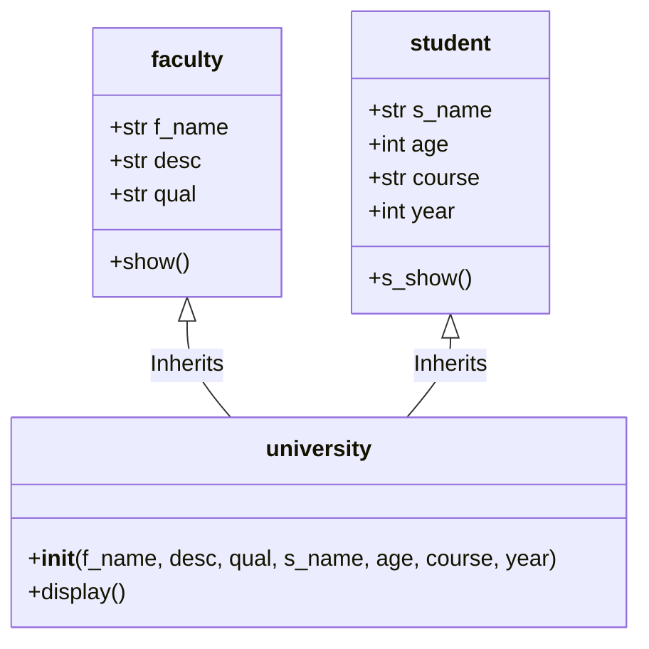

# 🎓 University & Student Management System

The **University Management System** (`student_management_project.py`) illustrates **Multiple Inheritance** in Python, demonstrating how child classes aggregate attributes and behaviors from multiple parent classes.

---

## 🏛️ Class Hierarchy Diagram



---

## 💻 Code Implementation Analysis

### 1. Parent Classes
- `faculty`: Handles faculty name, designation, and qualification.
- `student`: Handles student name, age, enrolled course, and year of study.

### 2. Derived Class (`university`)
The `university` class inherits from both `faculty` and `student`:

```python
class university(faculty, student):
    def __init__(self, f_name, desc, qual, s_name, age, course, year):
        # Explicit initialization of both parent classes
        faculty.__init__(self, f_name, desc, qual)
        student.__init__(self, s_name, age, course, year)

    def display(self):
        self.show()
        self.s_show()
```

---

## 💡 Key Takeaways
- Demonstrates how Python resolves **Method Resolution Order (MRO)** in multiple inheritance.
- Illustrates explicit constructor invocation to initialize shared instances cleanly.
